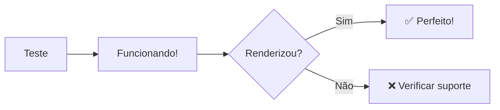
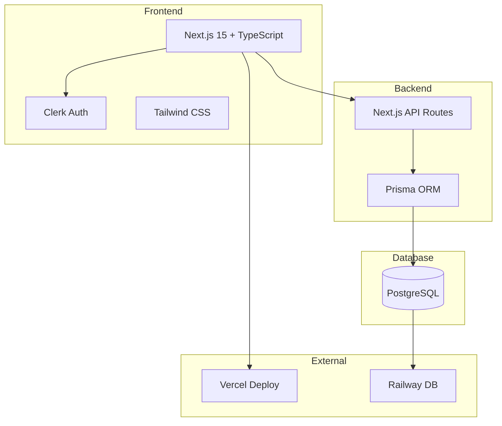
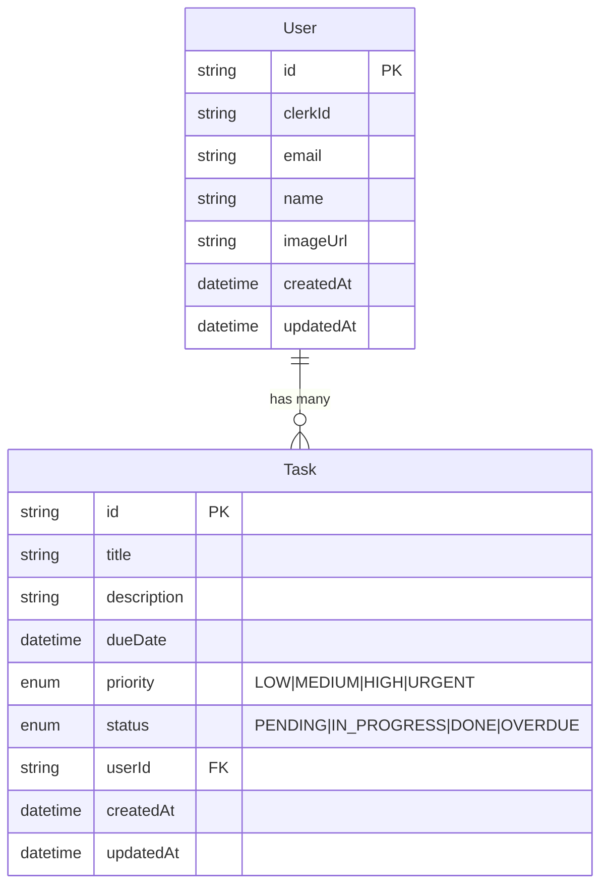
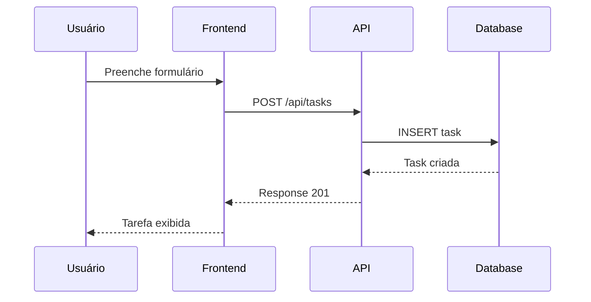
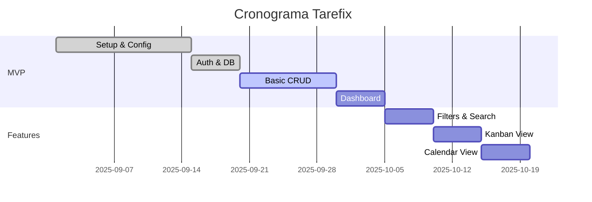

# 🧪 **TESTE MERMAID - TAREFIX**

> **Arquivo de teste para verificar renderização dos diagramas**

## 🔍 **Teste Rápido de Renderização**

Teste simples para verificar se Mermaid está funcionando:

## 📊 **Diagrama Atual do Tarefix (Simplificado)**

## 🗄️ **Modelo de Dados Atual**

## 🔄 **Fluxo de Criação de Tarefa**

## 🏗️ **Status do Desenvolvimento**

---

**💡 Dica:** Se você conseguir ver estes diagramas renderizados, significa que o Mermaid está funcionando perfeitamente na sua plataforma!