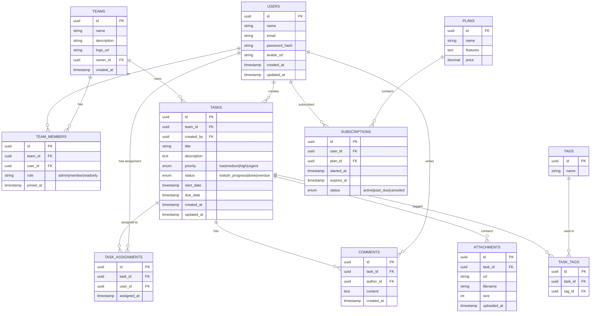
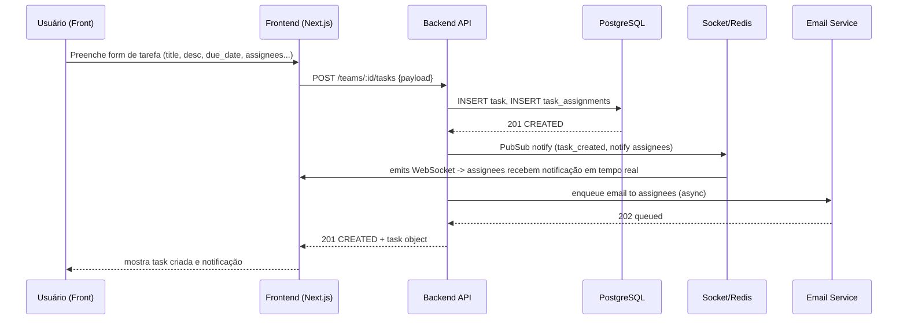
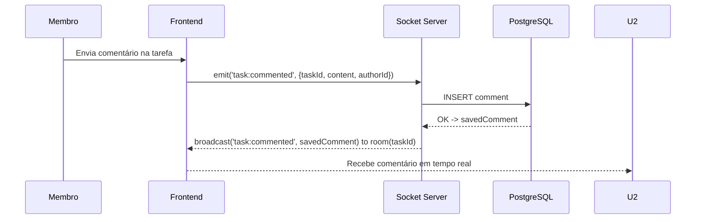
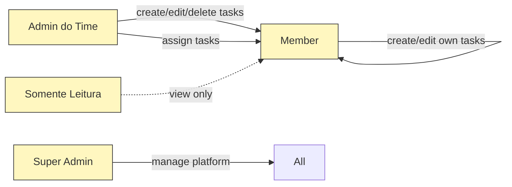
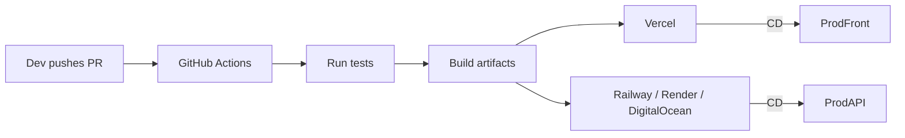

# Tarefix — Diagramas Mermaid (Arquitetura, Fluxos e ERD)

Este documento contém **todos os diagramas em Mermaid** prontos para usar no seu repositório ou em [https://mermaid.live](https://mermaid.live). Copie e cole os blocos `mermaid` onde precisar.

---

## 1) Diagrama de Arquitetura (alto nível)

```mermaid
flowchart LR
  %% Clientes
  Browser[Usuário (Browser / Mobile App)]

  %% Frontend
  subgraph Frontend
    NextJS[Next.js (React) - UI / SSR / Client]
  end

  Browser -->|HTTPS| NextJS

  %% Autenticação
  subgraph Auth
    NextAuth[NextAuth (API Routes)]
  end
  NextJS -->|Auth Requests / Session| NextAuth

  %% Backend / API
  subgraph Backend
    API[Next.js API / Node.js (Business API)]
    Socket[Realtime Server (Socket.io) / WebSocket]
  end
  NextJS -->|API Calls (REST/GraphQL)| API
  NextJS -->|WebSocket| Socket

  %% Database & Cache & Storage
  subgraph Infra
    Postgres[(PostgreSQL - Prisma)]
    Redis[(Redis - Cache / PubSub / RateLimit)]
    S3[(Object Storage - S3 / DigitalOcean Spaces)]
  end
  API --> Postgres
  Socket --> Postgres
  API --> Redis
  Socket --> Redis
  API --> S3

  %% Serviços terceiros
  subgraph ThirdParty
    Stripe[Stripe (Pagamentos)]
    Email[Email Provider (SendGrid / SES)]
    Storage[CDN (Cloudflare / Cloudfront)]
    CI[GitHub Actions CI/CD]
    Monitoring[Sentry / Prometheus]
  end
  API -->|Payments| Stripe
  API -->|Emails| Email
  API -->|CDN| Storage
  CI -->|Deploy| NextJS
  CI -->|Deploy| API
  API --> Monitoring
  Socket --> Monitoring

  %% Admin panel
  AdminUI[Admin Dashboard (Next.js - Role: Super Admin)]
  AdminUI -->|Admin API| API

  classDef infra fill:#f9f,stroke:#333,stroke-width:1px;
  class Infra infra
```

**Notas**:

* `NextAuth` roda em API Routes do Next.js (padrão). Use `Prisma Adapter` para armazenar contas/sessions em PostgreSQL.
* `Socket.io` pode rodar dentro do mesmo servidor do Backend (serverless caveats) ou em um serviço dedicado (Recomendado: servidor persistente/Instance ou PaaS que suporta WebSocket).
* `Redis` serve para Pub/Sub (notificações em tempo real), cache e rate-limiting.
* `S3` para anexos de tarefas.

---

## 2) Diagrama ER (Modelo de dados simplificado)



**Notas**:

* Use `Prisma` para gerar migrations a partir deste modelo (ajuste nomes de campos e tipos conforme necessidade).
* Considere índices em `task.due_date`, `task.status`, `task.team_id` e `team_members.team_id,user_id`.

---

## 3) Fluxo do Usuário — Signup / Criar Time / Convidar

```mermaid
flowchart TD
  A[Usuário abre app] --> B[Signup / Login]
  B --> C{Usuário novo?}
  C -->|Sim| D[Preenche perfil (nome, foto...)]
  D --> E[Opção: Criar Time ou Entrar via convite]
  E --> F{Criar Time}
  F -->|Criar| G[Form: nome do time, descrição, convidar emails]
  G --> H[Time criado; usuário é Admin do Time]
  H --> I[Dashboard do Time]
  E -->|Entrar via convite| J[Insere token/aceita convite]
  J --> K[Entrou no time como Member/Role conforme convite]
  K --> I

  C -->|Não| L[Login -> Redirect para Dashboard/Último Time]
  L --> I
```

---

## 4) Fluxo: Criar Tarefa e Atribuir + Notificação (Sequence)



**Observações**:

* Enviei notificações em 2 canais: WebSocket (tempo real) e Email (fallback/persistente).
* Use background workers (ex: BullMQ + Redis) para envio de emails e tasks demoradas.

---

## 5) Fluxo: Comentários/Chat por Tarefa



**Dica**: mantenha um evento `room` por `taskId` para broadcast e use TTL para mensagens em cache se desejar.

---

## 6) Diagrama de Fluxos de Permissões (RBAC simplificado)



---

## 7) Sequência de Deploy / CI (High-level)



---

## 8) Instruções de uso

1. Copie cada bloco `mermaid` para `.md` ou para o editor do Mermaid Live ([https://mermaid.live](https://mermaid.live)).
2. Para renderizar localmente em docs: use `MkDocs` ou `Docusaurus` com plugin Mermaid, ou `vite-plugin-markdown` com `mermaid`.
3. Ajuste nomes de serviços e endpoints conforme a implementação real.

---

## 9) Checklist de Implementação (prático)

* [ ] Implementar schema Prisma baseado no ERD.
* [ ] Configurar NextAuth com adapter Prisma (tabelas `users`, `accounts`, `sessions`).
* [ ] Estruturar API Routes: `/teams`, `/tasks`, `/comments`, `/members`, `/reports`.
* [ ] Implementar Socket.io ou alternativa (pusher) e integração com Redis Pub/Sub.
* [ ] Upload de anexos para S3 e servir via CDN.
* [ ] Relatórios: queries otimizadas (use materialized views se necessário).
* [ ] Background worker (BullMQ) para emails e jobs demorados.
* [ ] Testes end-to-end (Cypress) e unitários (Jest).

---

Se quiser, eu posso:

* Gerar um **arquivo .md** pronto com esses diagramas para você adicionar ao repositório.
* Gerar **SVGs** a partir dos diagramas (preciso que confirme para gerar arquivos).
* Gerar o **schema Prisma** baseado no ERD.

Diga qual próximo passo você quer: `arquivo .md` | `SVGs` | `schema Prisma` | `diagramas adicionais`.
